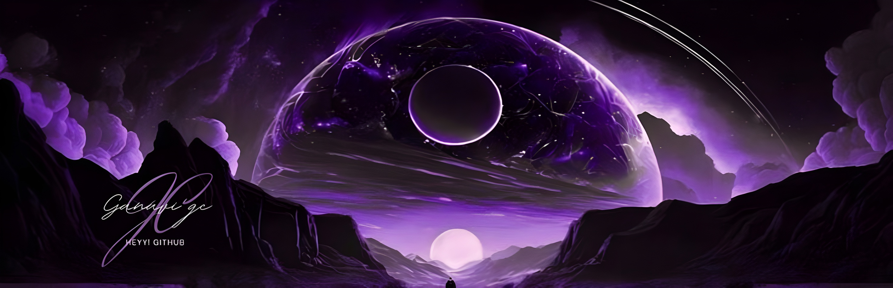
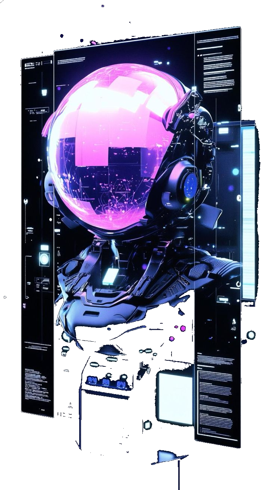

<!-- Banner Image -->

  

Wassup!!

I'm a Computer Science student working on Graphics Programming, Real Time Rendering, and GPU accelerated computing. I thrive on turning complex mathematical ideas into visually stunning, high performance solutions through code. My journey with Cherno and hands on project experience have allowed me to build a solid foundation in rendering pipelines, shader development, and low-level graphics architecture.

I'm especially fascinated by how real time rendering techniques push the boundaries of what's visually possible  whether it's implementing physically based rendering systems or working close to the metal with modern graphics APIs. I enjoy the creative challenge of exploring uncharted territories in graphics and pushing the limits of what GPUs can do.

Currently, I'm on a mission to grow as a graphics engineer and I'm actively seeking meaningful internship opportunities where I can contribute, collaborate, and learn in high impact environments.

 <a href="https://discord.com/users/pippo_popi" target="_blank" rel="noreferrer"> <picture> <source media="(prefers-color-scheme: dark)" srcset="https://raw.githubusercontent.com/danielcranney/readme-generator/main/public/icons/socials/discord-dark.svg" /> <source media="(prefers-color-scheme: light)" srcset="https://raw.githubusercontent.com/danielcranney/readme-generator/main/public/icons/socials/discord.svg" />  </picture> </a> <a href="https://www.github.com/Ganavi-GC" target="_blank" rel="noreferrer"> <picture> <source media="(prefers-color-scheme: dark)" srcset="https://raw.githubusercontent.com/danielcranney/readme-generator/main/public/icons/socials/github-dark.svg" /> <source media="(prefers-color-scheme: light)" srcset="https://raw.githubusercontent.com/danielcranney/readme-generator/main/public/icons/socials/github.svg" />  </picture> </a> <a href="https://www.instagram.com/codelvl0?igsh=OWY5M2J5Nm9meHg4" target="_blank" rel="noreferrer"> <picture> <source media="(prefers-color-scheme: dark)" srcset="https://raw.githubusercontent.com/danielcranney/readme-generator/main/public/icons/socials/instagram-dark.svg" /> <source media="(prefers-color-scheme: light)" srcset="https://raw.githubusercontent.com/danielcranney/readme-generator/main/public/icons/socials/instagram.svg" />  </picture> </a> <a href="https://www.linkedin.com/in/ganavi-gc" target="_blank" rel="noreferrer"> <picture> <source media="(prefers-color-scheme: dark)" srcset="https://raw.githubusercontent.com/danielcranney/readme-generator/main/public/icons/socials/linkedin-dark.svg" /> <source media="(prefers-color-scheme: light)" srcset="https://raw.githubusercontent.com/danielcranney/readme-generator/main/public/icons/socials/linkedin.svg" />  </picture> </a>

